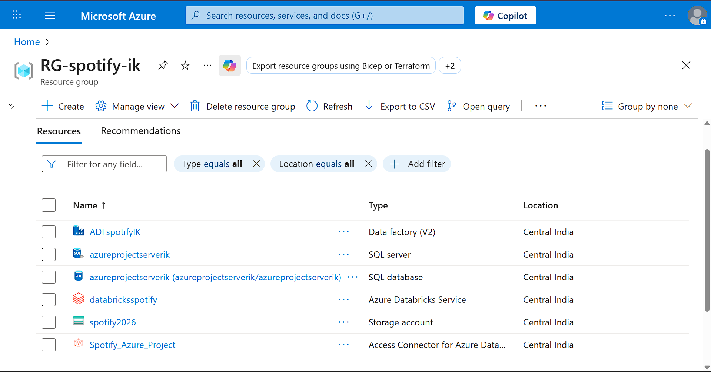

# 🎵 Spotify End-to-End Azure Data Engineering Project

### 1. Project Overview

This project builds a complete end-to-end data engineering pipeline on Microsoft Azure. It simulates a real-world scenario where we analyze **Spotify** music data (artists, albums, tracks) to derive insights. The project moves data from a transactional system (Azure SQL Database) to a Data Lake, processes it using the "Medallion Architecture" (Bronze, Silver, Gold), and prepares it for reporting.

**Key Features:**

- **Incremental Data Loading:** Efficiently processing only new or modified data.
    
- **Backfilling Mechanism:** Capability to re-process historical data dynamically.
    
- **Schema Evolution:** Handling changes in source data structure automatically.
    
- **CI/CD:** Automated deployment using GitHub and Databricks Asset Bundles (DABs).
    

---

### 2. Architecture

The solution follows the **Lakehouse / Medallion Architecture**:

1. **Source:** **Azure SQL Database** acts as the on-premise/transactional source system containing raw music data.
    
2. **Ingestion:** **Azure Data Factory (ADF)** orchestrates the movement of data from SQL to **Azure Data Lake Gen2** (Bronze Layer).
    
3. **Transformation:** **Azure Databricks** processes the data:
    
    - **Bronze:** Raw data landing zone.
        
    - **Silver:** Cleaned and standardized data.
        
    - **Gold:** Aggregated business-level data (Star Schema).
        
4. **Serving:** Data is served via Databricks SQL / Azure Synapse for analysis.
    
5. **Monitoring:** **Azure Logic Apps** sends email alerts on pipeline failures.
    

_(Paste your Architecture Diagram screenshot here)_

> **[Insert Screenshot: Project Architecture Diagram]**

---

### 3. Tech Stack

- **Cloud Platform:** Microsoft Azure
    
- **Data Ingestion:** Azure Data Factory (ADF)
    
- **Storage:** Azure Data Lake Storage Gen2 (ADLS)
    
- **Data Processing:** Azure Databricks (PySpark, Autoloader, Delta Live Tables)
    
- **Database:** Azure SQL Database
    
- **Version Control:** Git & GitHub
    
- **Orchestration & Monitoring:** ADF & Azure Logic Apps
    

---

### 4. Environment Setup & Resource Creation

Before building the pipelines, the following resources were set up in a dedicated Resource Group (`RG_Azure_Project`):

#### **A. Azure Storage Account (Data Lake)**

- **Resource:** Azure Data Lake Storage Gen2
    
- **Containers Created:**
    
    - `bronze`: For raw data ingestion.
        
    - `silver`: For cleaned/transformed data.
        
    - `gold`: For final aggregated data.
        
- **Configuration:** Enabled "Hierarchical Namespaces" to support folder structures.
    

#### **B. Azure Data Factory (ADF)**

- **Resource:** Data Factory (`factory-azure-project`)
    
- **Git Integration:** Connected ADF to this GitHub repository.
    
    - **Repository Type:** GitHub
        
    - **Collaboration Branch:** `main`
        
    - **Feature Branch:** Created a new branch (e.g., `dev` or `anchal`) for development to follow CI/CD best practices.
        

#### **C. Azure SQL Database (The Source)**

- **Resource:** Azure SQL Database & Server
    
- **Setup:**
    
    - Created a "Serverless" SQL database to optimize costs.
        
    - Configured Firewall rules to "Allow Azure Services" to access the DB.
        
- **Data Population:** Executed a SQL script to create and populate the initial tables:
    
    - `dbo.dim_users`
        
    - `dbo.dim_artists`
        
    - `dbo.dim_albums`
        
    - `dbo.dim_tracks`
        
    - `dbo.fact_streams`
        



---

### 5. Data Model (Source)

The source data mimics a Spotify database schema:

- **`dim_users`**: User details (ID, Name, Country, Subscription Type).
    
- **`dim_artists`**: Artist details (ID, Name, Genre).
    
- **`dim_tracks`**: Track information (ID, Name, Duration, Release Date).
    
- **`fact_streams`**: Transactional table recording every stream event.
    

---

# 🛠️ Part 2: Data Ingestion (Source to Bronze)

### 1. The Strategy: Metadata-Driven & Incremental

Instead of reloading the entire database every day (Full Load), this project uses an **Incremental Loading** strategy. We only fetch data that has changed or been added since the last run.

To achieve this, I implemented a **Watermarking** technique using external control files rather than a control table in the database.

### 2. Linked Services (Connections)

Two reusable Linked Services were created to establish connections:

- **`ls_AzureSqlDatabase`**: Connects to the source Azure SQL Database using SQL Authentication (stored securely).
    
- **`ls_AdlsGen2`**: Connects to the destination Azure Data Lake Storage Gen2.
    

> **[Insert Screenshot: ADF Manage Tab showing Linked Services]**

---

### 3. Pipeline Logic: `pl_ingest_incremental`

This pipeline handles the extraction logic for a single table. It is designed to be **generic** and accepts parameters (`SchemaName`, `TableName`, `WatermarkColumn`) so it can be reused for any table.

**The Workflow:**

#### **Step A: Fetch Last Load Timestamp (Watermark)**

- **Activity:** Lookup
    
- **Source:** A JSON file (`cdc.json`) stored in the Data Lake.
    
- **Purpose:** Retrieves the timestamp of the last successful data load (e.g., `2023-01-01 10:00:00`).
    

#### **Step B: Extract Data (Source to Bronze)**

- **Activity:** Copy Data
    
- **Source:** Azure SQL Database
    
- **Logic:** Used a **Dynamic SQL Query** to fetch only new records.
    
    SQL
    
    ```
    SELECT * FROM @{pipeline().parameters.SchemaName}.@{pipeline().parameters.TableName}
    WHERE @{pipeline().parameters.WatermarkColumn} > '@{activity('LookupWatermark').output.firstRow.value}'
    ```
    
- **Sink:** Azure Data Lake Gen2 (Bronze Container).
    
- **Format:** Parquet (Snappy Compressed) for efficient storage.
    

#### **Step C: Calculate New Watermark**

- **Activity:** Script / Lookup
    
- **Logic:** Queries the source table immediately after extraction to find the new maximum timestamp.
    
    SQL
    
    ```
    SELECT MAX(@{pipeline().parameters.WatermarkColumn}) as NewWatermark
    FROM @{pipeline().parameters.SchemaName}.@{pipeline().parameters.TableName}
    ```
    

#### **Step D: Update Watermark File**

- **Activity:** Copy Data
    
- **Logic:** Writes the `NewWatermark` value back to the `cdc.json` file in the Data Lake, ready for the next run.
    

> **[Insert Screenshot: The 'pl_ingest_incremental' pipeline canvas]**

---

### 4. Handling "No New Data" (Optimization)

A common issue in incremental pipelines is generating empty files when no new data exists in the source.

- **Solution:** Implemented an **If Condition** block after the Copy Activity.
    
- **Check:** `@{activity('CopyData').output.rowsRead} > 0`
    
    - **True:** Proceed to update the Watermark file.
        
    - **False:** Do not update the watermark. Instead, use a **Delete Activity** to remove the empty file generated in the Bronze layer to keep the lake clean.
        

> **[Insert Screenshot: The 'If Condition' logic for 0 rows]**

---

### 5. Orchestration: The "Master" Loop

To avoid creating five separate pipelines for five tables, I created a parent pipeline: **`pl_master_ingestion`**.

- **Activity:** ForEach Loop
    
- **Input:** An array of metadata objects defining the tables to be loaded.
    
    JSON
    
    ```
    [
      {"Schema": "dbo", "Table": "dim_users", "Col": "updated_at"},
      {"Schema": "dbo", "Table": "fact_streams", "Col": "stream_date"}
    ]
    ```
    
- **Execution:** The loop iterates through this list and triggers the `pl_ingest_incremental` pipeline for each item, passing the dynamic parameters.
    

> **[Insert Screenshot: The Master Pipeline with ForEach Loop]**

---

# 🧠 Part 3: Data Transformation (Bronze to Silver)

### 1. Unity Catalog & Environment Setup

To ensure governance and security, I avoided the old "Mount Point" approach and used **Unity Catalog** with **External Locations**.

- **Metastore & Catalog:** Created a dedicated catalog named `spotify_catalog`.
    
- **External Locations:** Configured external locations to securely access ADLS Gen2 containers (`bronze`, `silver`, `gold`) without hardcoding credentials in notebooks.
    
- **Compute:** Used **Serverless Compute** for fast startup times and efficient scaling.
    

> **[Insert Screenshot: Databricks Catalog Explorer showing 'spotify_catalog' and External Locations]**

---

### 2. Ingestion Strategy: Auto Loader (`cloudFiles`)

Instead of standard batch processing, I used **Databricks Auto Loader** (`cloudFiles`). This allows the system to process data continuously and efficiently as files land in the lake.

- **Schema Evolution:** Enabled `cloudFiles.schemaEvolutionMode` to "rescue" data. If the source schema changes (e.g., a new column is added), the pipeline doesn't fail; instead, it captures the extra data in a `_rescued_data` column.
    
- **Checkpointing:** Maintained state using checkpoints to ensure **Exactly-Once** processing (idempotency).
    

**Code Snippet (Reading Stream):**

Python

```
df = spark.readStream.format("cloudFiles") \
    .option("cloudFiles.format", "parquet") \
    .option("cloudFiles.schemaLocation", schema_location) \
    .load(bronze_path)
```

> **[Insert Screenshot: Notebook cell showing Auto Loader read logic]**

---

### 3. Data Cleaning & Modular Coding (Utilities)

To keep the code clean and reusable, I applied **Software Engineering Best Practices**:

- **Custom Utilities:** Instead of rewriting logic repeatedly, I created a Python class `Reusable` inside a `utils` folder.
    
- **Functionality:** Created methods like `drop_columns` to handle repetitive tasks like removing the `_rescued_data` column after processing.
    
- **Path Management:** Used `sys.path.append` to dynamically import these custom modules into the main notebook.
    

**Transformations Applied:**

- **`dim_users`:** Standardized usernames to Uppercase using `upper()`.
    
- **`dim_tracks`:** Created a derived column `duration_flag` (Short/Medium/Long) using conditional logic (`when/otherwise`).
    
- **`dim_artists`:** Removed special characters from names using **Regex** (`regexp_replace`).
    

> **[Insert Screenshot: The 'utils' folder structure and the 'Reusable' class code]**

---

### 4. Advanced: Metadata-Driven Transformation (Jinja Templates)

For the complex joins in the Silver layer (creating Business Views), I implemented a **Metadata-Driven** approach using **Jinja Templates**.

- **The Problem:** Writing static SQL queries for every join scenario is tedious and hard to maintain.
    
- **The Solution:** I created a generic SQL template using Jinja (a Python templating engine).
    
- **How it works:**
    
    1. Defined a Dictionary containing table names, join conditions, and required columns.
        
    2. Passed this dictionary to the Jinja renderer.
        
    3. The system **Dynamically Generates the SQL Query** at runtime.
        

This demonstrates the ability to build flexible frameworks rather than just writing hardcoded SQL.

**Jinja Code Snippet:**

Python

```
from jinja2 import Template

query_template = """
SELECT 
    
        {{ col }}, 
    
FROM {{ base_table }}

    LEFT JOIN {{ join.table }} ON {{ join.condition }}

"""
# Renders the final SQL query dynamically
```

> **[Insert Screenshot: Jinja Template Logic dynamically generating a SQL query]**

---

# 🏆 Part 4: Gold Layer (SCD Type 2 & Data Quality)

### 1. The Goal: Slowly Changing Dimensions (SCD Type 2)

For the final "Gold" layer, we needed to track the **history of changes**.

- **Scenario:** If a user changes their subscription plan or an artist changes their genre, we don't just want to overwrite the old data (SCD Type 1). We want to keep a record of _when_ that change happened.
    
- **Solution:** Implement **SCD Type 2**, which adds `start_date` and `end_date` columns to every record to track validity periods.
    

### 2. The Tool: Delta Live Tables (DLT) & Declarative Pipelines

Instead of writing complex merge logic manually (which is error-prone), I used **Delta Live Tables (DLT)**. This allows for a **Declarative** approach—I simply define _what_ I want (e.g., "Keep history based on these keys"), and DLT handles the _how_ (inserts, updates, expiring old records).

> **[Insert Screenshot: The Lakeflow / DLT Pipeline Graph showing the flow from Staging to Dim]**

---

### 3. Implementation Details (Python & DLT)

#### **Step A: Staging Layer (Reading Silver)**

First, I created a staging view that reads from the Silver table. This acts as the source for our SCD logic.

Python

```
import dlt
from pyspark.sql.functions import *

@dlt.table
def dim_user_staging():
    return spark.read.table("spotify_catalog.silver.dim_user")
```

#### **Step B: Applying SCD Type 2 Logic (Auto CDC)**

I used the `dlt.apply_changes()` function (also known as Auto CDC) to automatically handle the history tracking.

- **`target`**: The final Gold table (`dim_user`).
    
- **`keys`**: The primary key (`user_id`).
    
- **`sequence_by`**: The column used to order events (`updated_at`). This ensures that even if data arrives out of order, the pipeline picks the latest value correctly.
    
- **`stored_as_scd_type`**: Set to `"2"` to enable history tracking.
    

Python

```
dlt.create_streaming_table("dim_user")

dlt.apply_changes(
    target = "dim_user",
    source = "dim_user_staging",
    keys = ["user_id"],
    sequence_by = col("updated_at"),
    stored_as_scd_type = "2"
)
```

> **[Insert Screenshot: The Code Cell showing the `dlt.apply_changes` logic]**

---

### 4. Data Quality Expectations (Validation)

To ensure reliable data in the Gold layer, I implemented **Expectations** (Data Quality Rules).

- **Rule:** `expect_all_or_drop`
    
- **Logic:** If a record fails the validation (e.g., `user_id` is Null), it is automatically dropped from the pipeline to prevent corrupting the downstream reports.
    

Python

```
@dlt.table
@dlt.expect_all_or_drop({"valid_id": "user_id IS NOT NULL"})
def dim_user_clean():
    # ... logic ...
```

---

### 5. Managing the Pipeline (Lakeflow)

The entire workflow is managed in the **Lakeflow Pipelines** UI (formerly DLT UI).

- **Mode:** Triggered (Batch) or Continuous (Streaming).
    
- **Compute:** Serverless (for fast startup and scaling).
    
- **Observability:** The UI provides a visual graph showing data lineage, processing speed, and the number of records dropped by validation rules.
    

> **[Insert Screenshot: The DLT Pipeline execution screen showing "Completed" status and record counts]**

---

# 🚀 Part 5: CI/CD & Production Deployment (Databricks Asset Bundles)

### 1. The Strategy: moving to "Infrastructure as Code" (IaC)

In the previous steps, we manually created notebooks and pipelines. In a real-world production environment, this is not scalable. To follow DevOps best practices, I implemented **Databricks Asset Bundles (DABs)** to manage the entire Databricks project as code.

- **Why DABs?** It allows us to package our Notebooks, Delta Live Tables, and Job definitions into a single bundle that can be version-controlled and deployed to multiple environments (Dev, QA, Prod) using a command line interface (CLI).
    

### 2. Setting up the Bundle

I initialized the project using the Databricks CLI within the workspace terminal.

- **Command:** `databricks bundle init`
    
- **Structure:** This created a standardized project structure containing:
    
    - `databricks.yml`: The master configuration file.
        
    - `src/`: Folder containing my source code (Notebooks, DLT pipelines).
        
    - `resources/`: Definitions for jobs and workflows.
        

> **[Insert Screenshot: The Folder Structure of the Asset Bundle in Databricks Workspace]**

### 3. Configuration (`databricks.yml`)

The `databricks.yml` file is the brain of the deployment. I configured it to support **Multi-Environment Deployment**.

- **Targets:** I defined two specific targets:
    
    1. **`dev`**: Deploys to my personal development workspace. It uses a "development" mode where resources are isolated.
        
    2. **`prod`**: Deploys to the production environment (simulated). It uses stricter permissions and a fixed "root path" to ensure stability.
        

**YAML Snippet:**

YAML

```
bundle:
  name: spotify_dab

targets:
  dev:
    mode: development
    default: true
    workspace:
      host: <my-dev-workspace-url>

  prod:
    mode: production
    workspace:
      host: <my-prod-workspace-url>
    root_path: /Shared/prod/spotify_project
```

> **[Insert Screenshot: The `databricks.yml` file configuration]**

### 4. Deployment (The CI/CD Workflow)

Instead of manually clicking "Publish," I used the terminal to deploy the entire project.

Step A: Validation

First, I verified that my configuration file was syntactically correct.

- `databricks bundle validate`
    

Step B: Deploy to Dev

I deployed the code to my personal sandbox to test the changes.

- `databricks bundle deploy -t dev`
    

Step C: Deploy to Prod

Once validated, I deployed the exact same bundle to the production target. This ensures consistency between environments.

- `databricks bundle deploy -t prod`
    

> **[Insert Screenshot: The Terminal showing the "Deployment Complete" success message]**

---

### 🎓 Project Conclusion

Summary:

This project successfully established an end-to-end data pipeline that:

1. **Ingests** data dynamically from Azure SQL to ADLS Gen2 using Metadata-driven ADF pipelines.
    
2. **Processes** data through a Medallion Architecture (Bronze $\rightarrow$ Silver $\rightarrow$ Gold) using Databricks Auto Loader & PySpark.
    
3. **Automates** complex warehousing tasks like SCD Type 2 using Delta Live Tables (DLT).
    
4. **Deploys** securely using modern CI/CD practices with Databricks Asset Bundles.
    

Business Value:

The solution provides the analytics team with a reliable, historical view of user listening habits, enabling data-driven decision-making for artist recommendations and user retention strategies.

---
